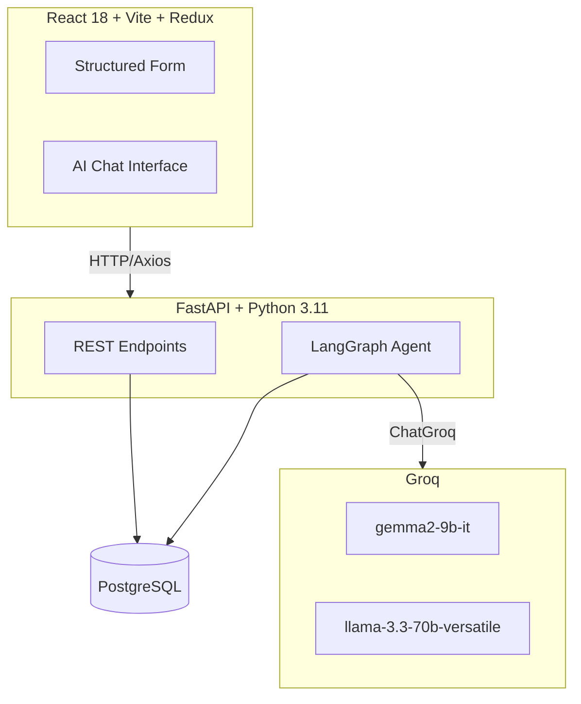
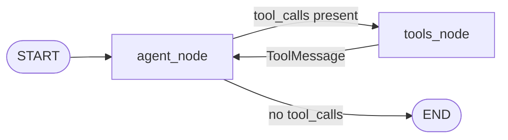

# AI-First CRM — HCP Log Interaction Module

A production-quality **Log Interaction Screen** for pharmaceutical field representatives to record meetings with Healthcare Professionals (HCPs). Supports both a **structured form** and a **conversational AI chat interface** powered by a real **LangGraph agent** calling **Groq LLMs**.


---

## Architecture



## LangGraph Flow



---

## Tech Stack

| Layer | Technology |
|---|---|
| Frontend | React 18 + Vite, Redux Toolkit, React Router, Axios |
| Styling | TailwindCSS, Google Inter font, light medical theme |
| Backend | Python 3.11, FastAPI, Uvicorn |
| Agent | LangGraph (`StateGraph`), LangChain-Groq |
| LLM | Groq — `gemma2-9b-it` (default) + `llama-3.3-70b-versatile` |
| Database | PostgreSQL 16 via SQLAlchemy 2.x async + Alembic |
| Container | Docker + docker-compose |
| Testing | pytest with mocked DB + httpx |

---

## The 5 LangGraph Tools

| Tool | Purpose | Example Prompt |
|---|---|---|
| `log_interaction` | Log a new meeting; AI extracts summary/sentiment/entities | *"Log a meeting with Dr. Sharma about Atorvastatin — she was enthusiastic"* |
| `edit_interaction` | Patch fields on an existing interaction | *"Edit interaction abc123 — change outcome to neutral"* |
| `search_hcp` | Find HCPs by name, specialty, or hospital | *"Find Dr. Patel"* |
| `schedule_followup` | Create a follow-up task on an interaction | *"Schedule a follow-up for interaction abc123 for next Monday"* |
| `get_interaction_history` | Retrieve recent HCP interactions | *"Show my last 5 interactions with Dr. Sharma"* |

---

## Setup Instructions

### Prerequisites

- Python 3.11+
- Node.js 18+
- PostgreSQL 14+ running locally **OR** Docker + docker-compose

---

### Option A: Docker (easiest)

```bash
# 1. Clone the repo
git clone https://github.com/indrareddy93/ai-crm-hcp-module.git
cd ai-crm-hcp-module

# 2. Add your Groq API key (get one free at https://console.groq.com/keys)
echo "GROQ_API_KEY=gsk_your_key_here" > .env

# 3. Start everything
docker-compose up --build

# 4. Open http://localhost:5173
```

---

### Option B: Manual Setup

#### Backend

```bash
cd backend

# Copy env file and fill in your key
cp .env.example .env
# Edit .env — set DATABASE_URL and GROQ_API_KEY

# Create virtual environment
python -m venv venv
source venv/bin/activate     # Windows: venv\Scripts\activate

# Install dependencies
pip install -r requirements.txt

# Run database migrations
alembic upgrade head

# Seed demo data (10 HCPs + 5 interactions)
python seed.py

# Start the API server
uvicorn app.main:app --reload --port 8000
```

#### Frontend

```bash
cd frontend

# Copy env file
cp .env.example .env
# VITE_API_URL=http://localhost:8000 (default, no changes needed)

# Install dependencies
npm install

# Start dev server
npm run dev

# Open http://localhost:5173
```

---

## API Reference

| Method | Endpoint | Description |
|---|---|---|
| `GET` | `/health` | Health check |
| `GET` | `/hcps?q=...` | Search HCPs by name/specialty/hospital |
| `POST` | `/hcps` | Create a new HCP |
| `GET` | `/hcps/{id}` | Get HCP by ID |
| `GET` | `/interactions` | List interactions (filterable by `hcp_id`) |
| `POST` | `/interactions` | Create interaction (form mode, no LLM) |
| `GET` | `/interactions/{id}` | Get interaction by ID |
| `PATCH` | `/interactions/{id}` | Update interaction fields |
| `POST` | `/chat` | Run LangGraph agent; returns full message list |

### POST /chat Request Body

```json
{
  "messages": [{ "role": "user", "content": "Log a meeting with Dr. Sharma..." }],
  "model": "gemma2-9b-it",
  "rep_id": "rep_001"
}
```

---

## Example Chat Prompts to Try

```
# Log a new interaction
"Log a meeting I had today with Dr. Sharma about Atorvastatin 20mg — she was positive and wants samples"

# Find an HCP
"Find Dr. Patel"
"Search for cardiologists at Apollo"

# Get history
"Show me my last 5 interactions with Dr. Sharma"
"What's my history with Dr. Patel?"

# Schedule a follow-up (use a real interaction ID from the DB)
"Schedule a follow-up for interaction <id> for next Tuesday to deliver samples"

# Edit an interaction
"Edit interaction <id> — actually the outcome was neutral, he wants more clinical data"
```

---

## Folder Structure

```
ai-crm-hcp-module/
├── README.md
├── docker-compose.yml
├── .gitignore
├── docs/
│   ├── architecture.md       # Mermaid diagrams
│   └── tools.md              # Tool specs
├── backend/
│   ├── .env.example
│   ├── requirements.txt
│   ├── alembic.ini
│   ├── alembic/versions/     # DB migration
│   ├── seed.py               # Demo data
│   ├── tests/                # pytest tests
│   └── app/
│       ├── main.py           # FastAPI app
│       ├── config.py         # Settings
│       ├── db/               # Async engine + session
│       ├── models/           # SQLAlchemy models
│       ├── schemas/          # Pydantic schemas
│       ├── api/              # REST endpoints
│       ├── agent/            # LangGraph graph + prompts
│       └── tools/            # 5 LangGraph tools
└── frontend/
    ├── package.json
    ├── vite.config.js
    ├── tailwind.config.js
    └── src/
        ├── store/            # Redux slices
        ├── api/              # Axios client
        ├── components/       # UI components
        └── pages/            # Route pages
```

---

## Testing

```bash
cd backend
source venv/bin/activate
pytest

# Expected output:
# tests/test_health.py::test_health PASSED
# tests/test_tools.py::TestSearchHCP::test_returns_list PASSED
# tests/test_tools.py::TestGetInteractionHistory::test_returns_list_with_uuid PASSED
# tests/test_tools.py::TestScheduleFollowup::test_invalid_date_returns_error PASSED
```

---

## Known Limitations & Future Work

- **Authentication:** Rep ID is hardcoded as `rep_001` — production would use JWT auth
- **Real-time updates:** Right rail refreshes on demand; WebSocket push would improve UX
- **Pagination:** Interaction list loads the 20 most recent; infinite scroll is planned
- **Follow-up UI:** Follow-ups are created via chat but no dedicated management page yet
- **Offline support:** No PWA/offline capability currently
- **Rate limiting:** Groq API calls are not rate-limited on the backend; add middleware for production

---

## Credits

Built as a take-home assignment demonstrating:
- Real LangGraph `StateGraph` with tool-calling loop
- Async PostgreSQL with SQLAlchemy 2.x
- Clean React + Redux architecture
- Production-ready FastAPI structure

**License:** MIT
