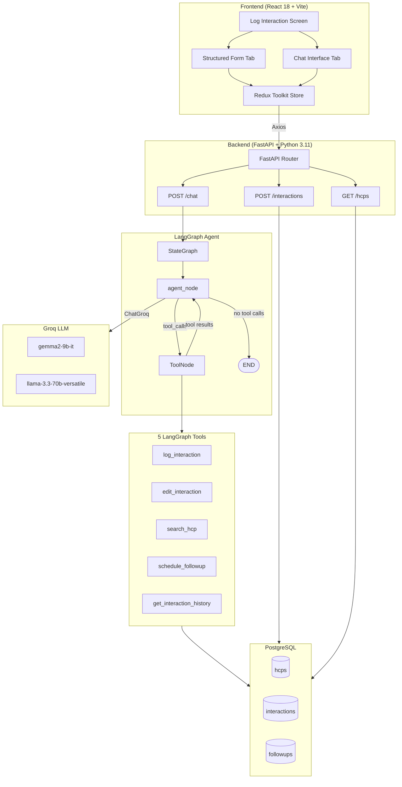
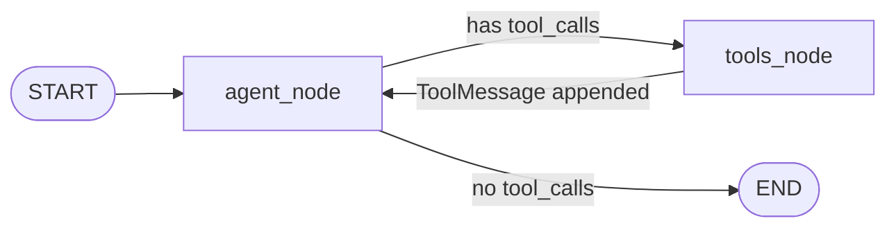
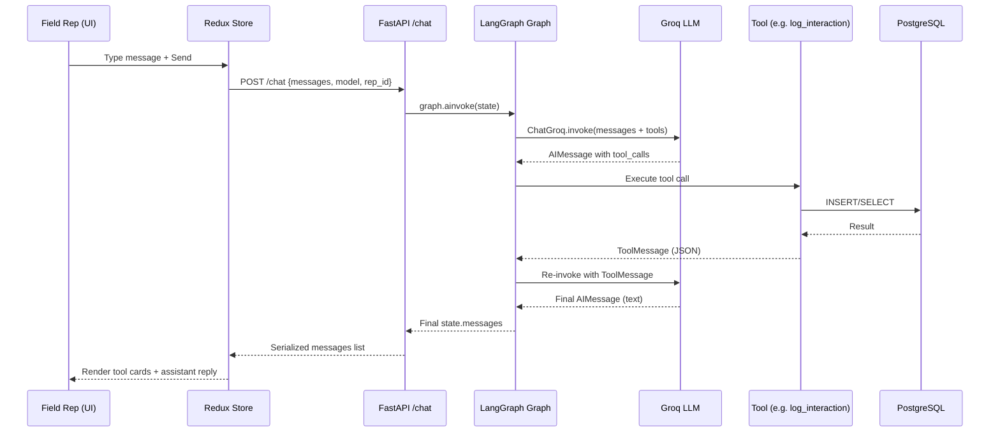

# System Architecture

## High-Level Architecture

```mermaid
graph TB
    subgraph Frontend["Frontend (React 18 + Vite)"]
        UI[Log Interaction Screen]
        Form[Structured Form Tab]
        Chat[Chat Interface Tab]
        Redux[Redux Toolkit Store]
        UI --> Form
        UI --> Chat
        Form --> Redux
        Chat --> Redux
    end

    subgraph Backend["Backend (FastAPI + Python 3.11)"]
        API[FastAPI Router]
        FormEndpoint[POST /interactions]
        ChatEndpoint[POST /chat]
        HCPEndpoint[GET /hcps]
        API --> FormEndpoint
        API --> ChatEndpoint
        API --> HCPEndpoint
    end

    subgraph Agent["LangGraph Agent"]
        Graph[StateGraph]
        AgentNode[agent_node]
        ToolsNode[ToolNode]
        Graph --> AgentNode
        AgentNode -->|tool_calls| ToolsNode
        ToolsNode -->|tool results| AgentNode
        AgentNode -->|no tool calls| End([END])
    end

    subgraph Tools["5 LangGraph Tools"]
        T1[log_interaction]
        T2[edit_interaction]
        T3[search_hcp]
        T4[schedule_followup]
        T5[get_interaction_history]
    end

    subgraph LLM["Groq LLM"]
        M1[gemma2-9b-it]
        M2[llama-3.3-70b-versatile]
    end

    subgraph DB["PostgreSQL"]
        HCPs[(hcps)]
        Interactions[(interactions)]
        Followups[(followups)]
    end

    Redux -->|Axios| API
    ChatEndpoint --> Graph
    AgentNode -->|ChatGroq| LLM
    ToolsNode --> Tools
    Tools --> DB
    FormEndpoint --> DB
    HCPEndpoint --> DB
```

## LangGraph Agent Flow

```mermaid
flowchart LR
    START([START]) --> agent_node
    agent_node -->|has tool_calls| tools_node
    tools_node -->|ToolMessage appended| agent_node
    agent_node -->|no tool_calls| END([END])
```

## Data Flow — Chat Mode

```mermaid
sequenceDiagram
    participant Rep as Field Rep (UI)
    participant Redux as Redux Store
    participant API as FastAPI /chat
    participant LG as LangGraph Graph
    participant Groq as Groq LLM
    participant Tool as Tool (e.g. log_interaction)
    participant DB as PostgreSQL

    Rep->>Redux: Type message + Send
    Redux->>API: POST /chat {messages, model, rep_id}
    API->>LG: graph.ainvoke(state)
    LG->>Groq: ChatGroq.invoke(messages + tools)
    Groq-->>LG: AIMessage with tool_calls
    LG->>Tool: Execute tool call
    Tool->>DB: INSERT/SELECT
    DB-->>Tool: Result
    Tool-->>LG: ToolMessage (JSON)
    LG->>Groq: Re-invoke with ToolMessage
    Groq-->>LG: Final AIMessage (text)
    LG-->>API: Final state.messages
    API-->>Redux: Serialized messages list
    Redux-->>Rep: Render tool cards + assistant reply
```
